# Home Network Domain Project — Part 4: Domain Expansion & Security Instrumentation

**Part 4 of a home network lab series.** Parts 1–3 built, segmented, and domained the network. This part expands `holl.domain` into a realistic, enterprise-style directory — departmental OUs, role-based access via AGDLP, file-share permissions, delegated administration, and a tiered admin model — then **instruments it for security work** by enabling Advanced Audit Policy logging and deploying Sysmon. The result is a domain that produces clean, attacker-relevant telemetry, ready for SIEM ingestion and detection labs in Part 5.

> **Scope note:** This part builds everything to a *correct, secure baseline*. Deliberate misconfigurations (Kerberoastable accounts, privilege-creep, etc.) are intentionally **deferred to Part 5**, so the secure starting state is established and understood first.

## Series

- [Part 1 — OPNsense Firewall/Router Deployment](https://github.com/TannerHollaway/ReplacingHomeRouterWithOPNsense)
- [Part 2 — VLAN Segmentation and Multi-SSID Wireless Setup](https://github.com/TannerHollaway/VLAN-Segmentation-and-Multi-SSID-Wireless-Setup)
- [Part 3 — Windows Server 2022 Active Directory Domain](https://github.com/TannerHollaway/Windows-Server-2022-Active-Directory-Domain)
- **Part 4 — Domain Expansion & Security Instrumentation** ← this repo

---

## Build Progress

> **Legend:** 

- **Phase 1** — Refactor OU structure to enterprise/departmental model
-  **Phase 2** — Departmental users and role groups
-  **Phase 3** — AGDLP group model (global role → domain local resource)
-  **Phase 4** — File server + share/NTFS permissions *(HR share built & verified; remaining department shares deferred)*
-  **Phase 5** — Delegated administration (Helpdesk password resets) *(HR worked example; lift to Departments level later)*
-  **Phase 6** — Tiered admin, Servers, and Service Account OUs *(OUs built in Phase 1; jdoe-adm dedicated admin account added)*
-  **Phase 7** — Advanced Audit Policy GPO (the security keystone)
-  **Phase 8** — Sysmon deployment via GPO
-  **Phase 9** — Verification

---

## Overview

Part 4 expands the single-domain lab from Part 3 into a realistic, enterprise-style Active Directory environment and instruments it for security work. It establishes a departmental OU structure, role-based file-share access via the AGDLP model, delegated helpdesk administration, and a dedicated admin account — then turns on the telemetry that makes the domain *detectable*: an Advanced Audit Policy GPO and fleet-wide Sysmon deployment. The result is a clean, securely-configured domain that produces attacker-relevant logs, ready for SIEM ingestion and detection/IR work in Part 5.

**Skills demonstrated:** enterprise OU design, AGDLP role-based access control, NTFS/share permissions, delegation of control, tiered administration model, Group Policy, Advanced Audit Policy configuration, Sysmon deployment, and security telemetry preparation.

---


```


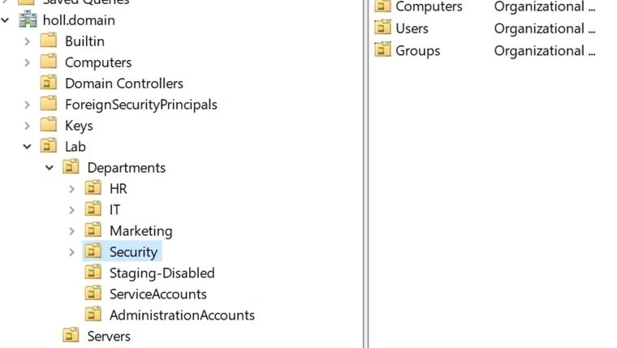

---

## Phase 1 — Refactor OU Structure


**Why:** Part 3 used an object-type layout (`Lab/Users`, `Lab/Groups`, `Lab/Computers`). Enterprise designs organize by department first, with object-type sub-OUs underneath, because delegation and GPO targeting happen per department.

**What was done:**
- Built the departmental model under `Lab`: `Departments` → `HR`, `IT`, `Marketing`, `Security`, each with `Computers`, `Groups`, `Users` sub-OUs; plus top-level `Servers`, `ServiceAccounts`, `AdministrationAccounts`, and `Staging-Disabled` OUs.
- Migrated existing `jdoe` and `IT-Staff` (from Part 3) into the `IT` OU.
- Retired the legacy object-type OUs (`Lab/Users`, `Lab/Groups`, `Lab/Computers`) once empty. *(Confirm these are removed — disable "Protect object from accidental deletion" under View → Advanced Features first.)*

> **Scope decision:** kept `AdministrationAccounts` and `ServiceAccounts` flat rather than building Tier0/1/2 sub-OUs. Under `Servers`, a `Tier1` sub-OU was created to hold member servers (FS01). Full admin-account tiering is only meaningful once enforced by deny-logon GPOs across multiple servers and admin accounts — out of scope at this lab's size — so it's noted as a scale-up step rather than built as empty containers.

*Before — the original mixed / object-type OU layout:*

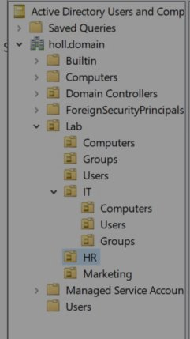

*After — the departmental structure:*


---

## Phase 2 — Departmental Users and Role Groups


**Why:** Users are the accounts; **global security groups** bundle them by role so policy and access attach to a role, not an individual.

**What was done:** Created one user and one global security role group per department, and added each user to its role group. Role groups are **Global** scope, **Security** type (the "G" in AGDLP), each placed in its department's `Groups` sub-OU.

| Department | User              | Role Group (Global / Security) |
| ---------- | ----------------- | ------------------------------ |
| IT         | jdoe              | IT-Staff                       |
| HR         | Alex Hernandez    | HR-Staff                       |
| Marketing  | Brian Jones (bjones) | Marketing-Staff               |
| Security   | Djobs             | Security-Staff                 |

*(Departmental users; additional users repeat the same pattern.)*

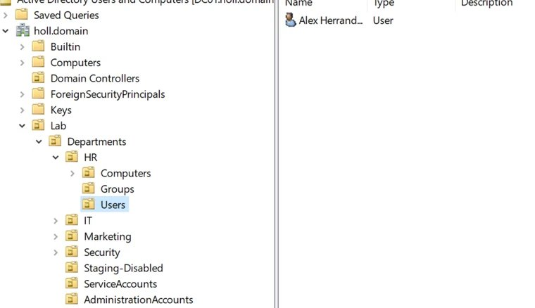

---

## Phase 3 — AGDLP Group Model


**Why:** Best-practice access control: **A**ccounts go into **G**lobal role groups, which nest into **D**omain **L**ocal resource groups, which receive the **P**ermission. This decouples "who someone is" from "what a resource grants."

**What was done:** Implemented the AGDLP chain for HR as the worked example. Created `HR-Share-RW` (**Domain Local** scope, Security type) in `HR/Groups`, then nested the global role group `HR-Staff` inside it as a member. The user (`ahernandez`) is a member of `HR-Staff` only — never added to the resource group directly.

The resulting chain: `ahernandez` → member of `HR-Staff` (Global) → member of `HR-Share-RW` (Domain Local) → will receive the share permission in Phase 4.

**Why the two scopes:** Global groups represent a *role* (the people) and are portable/usable across domains; Domain Local groups represent *access to a local resource* and are the scope designed to be applied to a resource's permissions. People go in Global, resources use Domain Local — which is the order AGDLP encodes. (In a single-domain environment either scope would function, but the correct scopes are used so the model scales without rework.)

> **Repeat per department** as each share is built: create `Marketing-Share-RW`, `IT-Share-RW`, etc. (Domain Local), and nest the matching `-Staff` global group into each. Same pattern, one per resource.

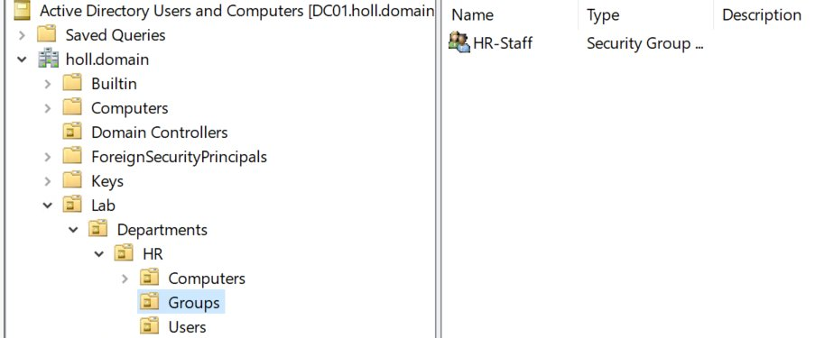

---

## Phase 4 — File Server and Share/NTFS Permissions

 *(HR share built & verified — Marketing / IT / Security shares to be added later)*

**Why:** Permissions need a resource to attach to. A dedicated member file server (**FS01**) is the enterprise-correct choice — user shares should *not* live on a domain controller. It also gives the `Servers/Tier1` OU a real occupant.

**What was done:**
- Stood up **FS01** (Windows Server 2022) on VLAN 10, static IP `10.10.10.20`, DNS pointed at the DC (`10.10.10.10`). Renamed, joined to `holl.domain`, and moved the computer object into `Servers/Tier1`.
- Created `C:\HR` and shared it (Advanced Sharing → share name `HR`). **Share permission:** `Authenticated Users` = Full Control — deliberately permissive, since NTFS is the real control layer (effective access = the more restrictive of share vs NTFS).
- **NTFS lockdown:** disabled inheritance (converted to explicit), removed the broad `Users` entry, kept `SYSTEM` and `Administrators` (Full Control), and added `HR-Share-RW` = **Modify** (not Full Control — end users get read/write, not the ability to re-permission or take ownership).
- **Verified end to end:** signed in as `ahernandez` (HR) → `\\FS01\HR` opened and a test file/folder wrote successfully (Modify confirmed). Signed in as `jdoe` (IT, not in HR-Share-RW) → *"You do not have permission to access \\FS01\HR"* — denied. Confirms the full chain: ahernandez → HR-Staff → HR-Share-RW → Modify, with non-members blocked.

> **Deferred:** the Marketing, IT, and Security shares will be added later, each following the identical pattern (Domain Local `<Dept>-Share-RW` group → nest the `<Dept>-Staff` global group → folder + share → NTFS Modify). HR stands as the verified worked example.

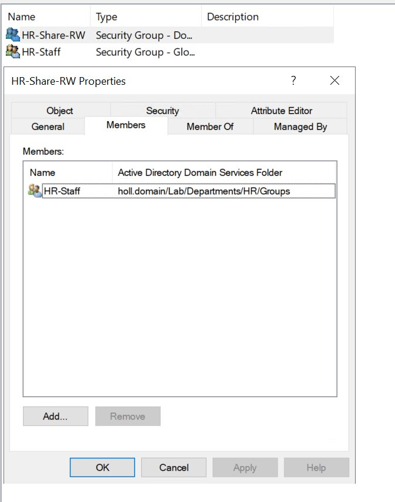
*HR user opens the share and writes a test file:*

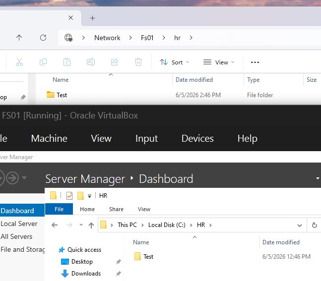

*Non-HR user (jdoe) is denied:*

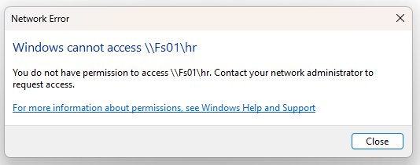

---

## Phase 5 — Delegated Administration

 *(HR worked example; delegate at the Departments level later to cover all departments)*

**Why:** Delegation lets a Helpdesk team perform scoped tasks (password resets) on specific OUs without being domain admins — least privilege, and a core T1/T2 helpdesk function.

**What was done:**
- Created a `Helpdesk` security group (Global / Security) in `IT/Groups`, plus a deliberately non-admin test user `hdesk1`, and added it to `Helpdesk`.
- Ran the Delegation of Control Wizard on the **HR** OU → delegated to `Helpdesk` the common task **"Reset user passwords and force password change at next logon."**
- Installed RSAT (AD DS and LDS Tools) on a client so `hdesk1` could run ADUC (see Troubleshooting — Windows Update FoD failed; installed from offline ISO).
- **Verified:** signed in as `hdesk1` (Helpdesk member) → reset the HR user's password → *"The password ... has been changed"* (success). Signed in as `jdoe` (IT, **not** a Helpdesk member) → attempted the same reset → *"Access is denied."* Confirms the reset right is granted by Helpdesk membership, not held by ordinary users.

> **Further verification (optional):** the OU *scope* could also be shown — a Helpdesk member resetting a password **outside** HR (e.g. an IT user) should be denied until/unless delegation is also applied there. Lifting the delegation to the `Departments` OU would grant Helpdesk reset rights across all departments at once, while admin accounts in `AdministrationAccounts` (outside Departments) stay out of reach.

*Delegation of Control Wizard — password reset delegated to Helpdesk on the HR OU:*

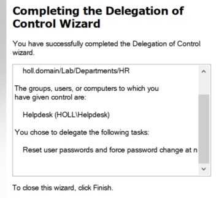

*hdesk1 (Helpdesk member) successfully resets an HR user password:*

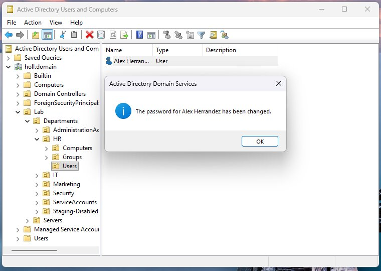

*jdoe (not a Helpdesk member) is denied:*

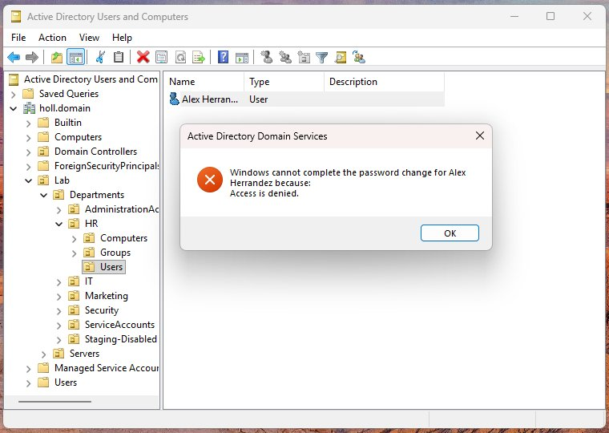

---

## Phase 6 — Tiered Admin, Servers, and Service Account OUs

 *(OUs built in Phase 1; dedicated admin account added)*

**Why:** Separating privileged accounts by tier (Tier 0 = identity/DCs, Tier 1 = servers, Tier 2 = workstations) is a foundational AD security control — it limits how far a single compromise can reach. Service accounts get their own OU so restrictive policy can be applied without touching real users.

**What was done:**
- The `AdministrationAccounts`, `ServiceAccounts`, `Staging-Disabled`, and `Servers/Tier1` OUs were created back in Phase 1.
- Created a **dedicated admin account `jdoe-adm`** in `AdministrationAccounts`, separate from the everyday `jdoe`, with its own distinct password. Added it **directly** to **Domain Admins**. This is the "don't use your daily account for admin work" principle — a phish of the low-privilege daily account no longer hands over the domain. The `-adm` suffix also makes admin-account usage stand out in logs.

> **Design decisions:**
> - Kept `AdministrationAccounts` **flat** (no Users/Groups or Tier0/1/2 sub-OUs) — at one admin account, sub-OUs would be empty ceremony. The full tiered structure is noted as a scale-up.
> - Kept **Domain Admins membership direct and minimal** rather than nesting a custom group into it — full DA should be auditable at a glance. The manage-via-group pattern is reserved for *scoped* admin roles (e.g. the `Helpdesk` group, or a future `Server-Admins` group), not for full domain admin.
> - **Deferred:** service accounts (created in Part 5 with the Kerberoastable SPN target), and the deny-logon **enforcement** GPO that stops `jdoe-adm` logging into workstations (built alongside Phase 7's GPO work).

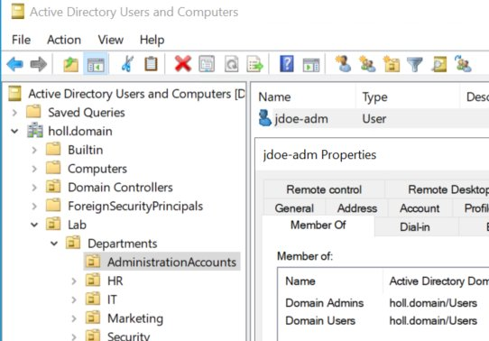

---

## Phase 7 — Advanced Audit Policy GPO (Security Keystone)


**Why:** This is what turns the domain into a *detectable* environment. Without it, attacks generate little or no usable telemetry and Part 5's SIEM has nothing to alert on.

**What was done:** Created the **`Audit Baseline`** GPO, linked at the domain root so it reaches DC01, FS01, and all clients. Enabled these subcategories under **Advanced Audit Policy Configuration → Audit Policies**:
- **Logon/Logoff → Audit Logon** — Success + Failure (4624 / 4625)
- **Logon/Logoff → Audit Special Logon** — privileged/admin logons (4672)
- **Account Management → User Account Management** — Success + Failure (4720 / 4722 / 4724 / 4726 / 4738)
- **Account Management → Security Group Management** — Success + Failure (4728 / 4732 / 4756; catches additions to privileged groups like Domain Admins)
- **Detailed Tracking → Process Creation** — Success (4688)
- **Account Logon → Kerberos Authentication Service** (4768) and **Kerberos Service Ticket Operations** (4769) — Success + Failure (Kerberos ticket visibility for Part 5)
- **Administrative Templates → System → Audit Process Creation → "Include command line in process creation events"** = **Enabled** (so 4688 records *what* ran, not just that something ran)

**Verified:** `auditpol /get /category:*` on a client confirmed every target subcategory reading Success / Success and Failure (not "No Auditing"). The Security log then showed live **4624** (logon), **4625** (failed logon, from a wrong-password test), and **4688** (process creation) events — with the **Process Command Line** field populated.

> **Key lessons:** (1) Audit logs are **per-machine** — the box being logged into records the interactive logon (4624/4625); the DC records the Kerberos authentication (4768/4769). Check the right machine's log. (2) Audit-policy GPO settings often don't take effect on a plain refresh; `gpupdate /force` (or a reboot) is needed to reapply security settings.

*Audit Baseline GPO (Kerberos subcategories) with DC audit-policy-change and logon events, plus gpresult on the client:*

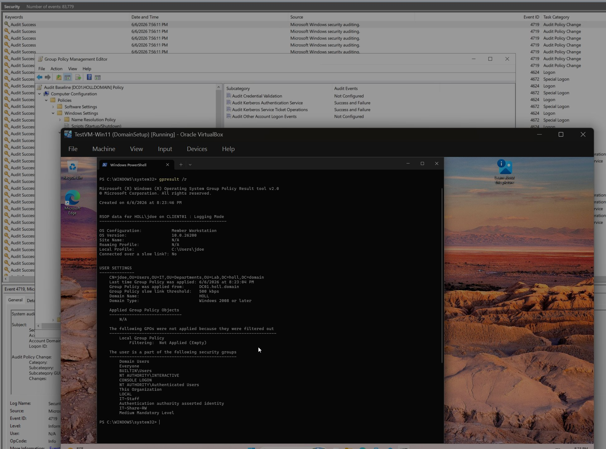

*auditpol confirming the subcategories are live on the client:*

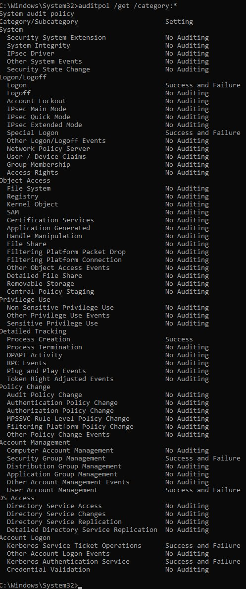

*Process Creation (4688) events in the client Security log:*

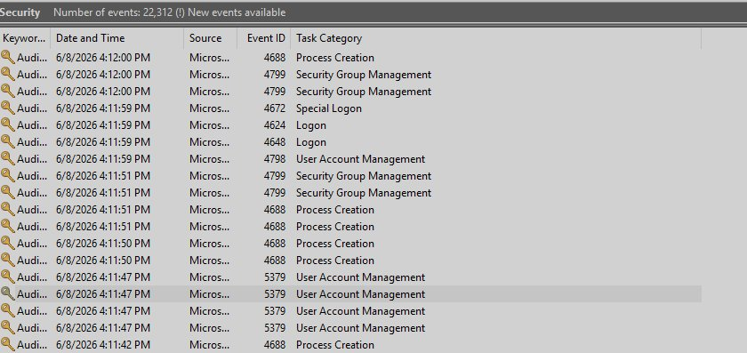

*Logon and failed-logon (4624 / 4625) events from the logon tests:*

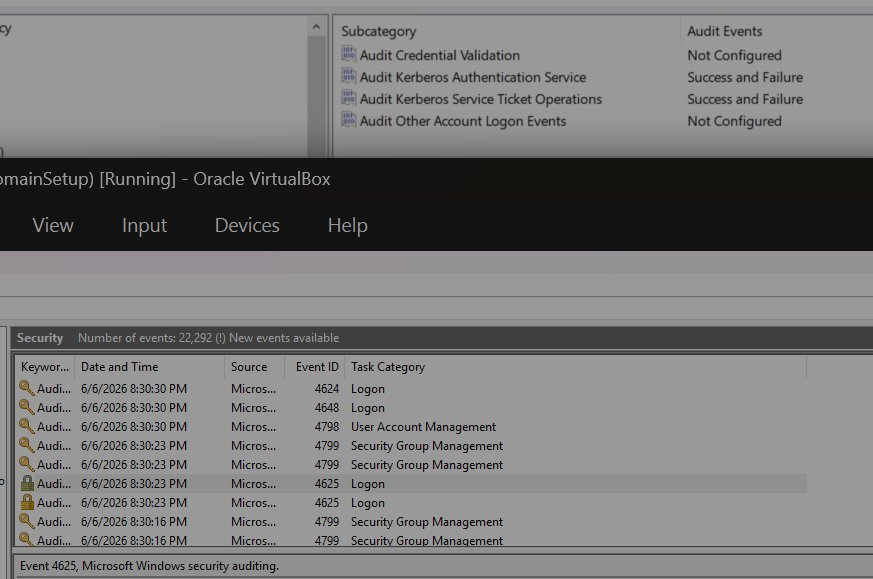

---

## Phase 8 — Sysmon Deployment via GPO

e

**Why:** Native Windows auditing is the baseline; Sysmon adds the richer process, network, and image-load events that make detection engineering practical.

**What was done:**
- **Validated manually first** on CLIENT01: installed Sysmon (v15.20) with SwiftOnSecurity's `sysmonconfig-export.xml` (`Sysmon64.exe -accepteula -i sysmonconfig-export.xml`) and confirmed rich telemetry in `Microsoft-Windows-Sysmon/Operational` — Process Create (ID 1) with parent process, hashes, full command line, and user; network connections (ID 3); DNS queries (ID 22).
- **Automated via GPO for the fleet:** staged `Sysmon64.exe` + `sysmonconfig-export.xml` in SYSVOL (`\\holl.domain\NETLOGON\Sysmon\`, readable by all domain machines), wrote an idempotent `install-sysmon.bat` (checks `sc query Sysmon64`; installs with `-i` if missing, refreshes config with `-c` if present), and set it as a **computer startup script** in a new `Sysmon Deployment` GPO linked at the domain root.
- **Verified the auto-deployment:** FS01, which never had Sysmon, installed it automatically on its next boot — `sc query Sysmon64` showed **RUNNING** and the Sysmon Operational log filled with events (Process Create, Registry value set, etc.) with no manual action.

> **Concept:** define once centrally → every machine self-installs on boot, and any new domain-joined machine onboards automatically. Note: startup scripts only run at boot, so already-running machines pick it up on next reboot (a GPO scheduled/immediate task is the alternative when a reboot isn't desired).

*Sysmon Operational log on CLIENT01 — Process Create (Event ID 1) with parent process, command line, and user:*

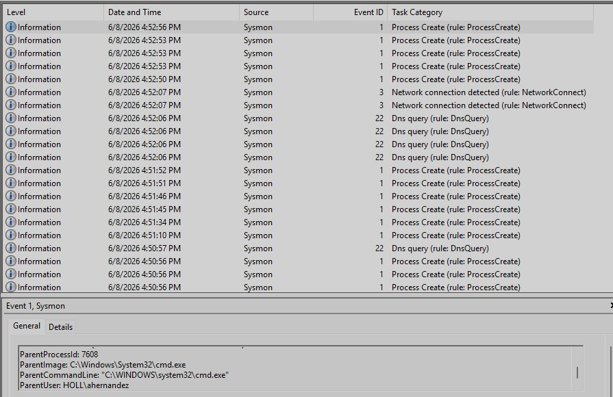

*sc query Sysmon64 on FS01 after the GPO auto-install shows the service RUNNING:*

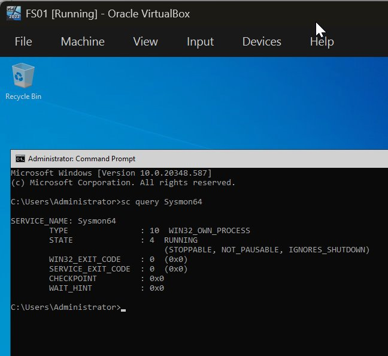

*FS01 Sysmon Operational log populating after the automatic install:*

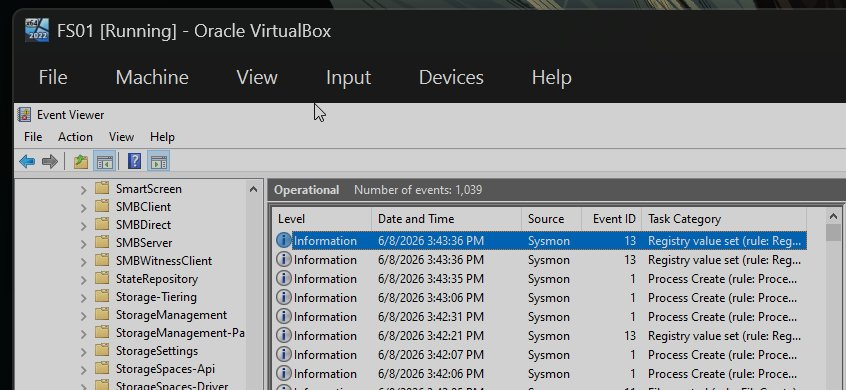

---

## Phase 9 — Verification


| Test | Check | Result |
| ---- | ----- | ------ |
| Share isolation | `ahernandez` (HR) opens `\\FS01\HR`; `jdoe` (IT) attempts it |  HR opened + wrote a file; IT denied |
| Delegation works | `hdesk1` (Helpdesk) resets an HR user's password |  Succeeded |
| Delegation membership-gated | `jdoe` (not in Helpdesk) attempts a reset |  Denied |
| Delegation OU-scoped | `hdesk1` attempts to reset a Marketing user (`bjones`, outside HR) |  Denied |
| Audit logging live | Event Viewer → Security after test logon/process |  4624 / 4625 / 4688 (with command line) present |
| Sysmon live | Sysmon/Operational on CLIENT01 and FS01 |  Events flowing on both |
| GPO applied | `auditpol` / `gpresult` / `sc query Sysmon64` |  Audit Baseline effective; Sysmon auto-installed |

*Delegation scope — hdesk1 (Helpdesk) denied resetting a Marketing user, since the delegation was granted only on the HR OU:*

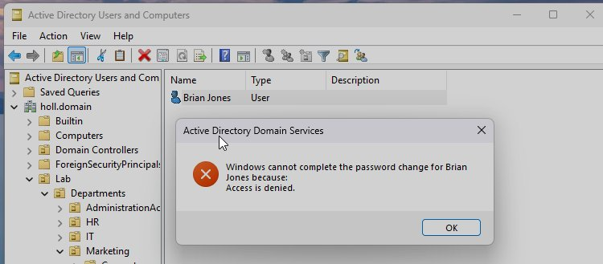

*The remaining verification evidence — share isolation, audit events, and Sysmon telemetry — appears in the Phase 4, 7, and 8 screenshots above.*

---

## Troubleshooting

### Issue — Could not log into CLIENT01 as "Administrator" (RSAT setup)

**Symptom:** Signing into CLIENT01 with the username `Administrator` returned *invalid credentials*, followed by *"delaying next attempt."*

**Root cause:** An unqualified `Administrator` is treated as the **local** Administrator account on CLIENT01 — which is disabled by default on Windows 10/11 and has a different password than the domain admin. The "delaying next attempt" message is just Windows throttling repeated failed logons, not a separate fault.

**Resolution:** Logged in with the domain-qualified account `HOLL\Administrator` (using the domain admin password set on DC01). The `HOLL\` prefix directs authentication to the domain rather than the local account database. A local admin account created during CLIENT01's setup would have worked equally well — installing an optional feature only requires *a* local admin.

**Lesson learned:** Always qualify domain logons as `DOMAIN\user` (or `user@domain`). An unqualified username authenticates against the local machine, not the domain — a common source of "invalid credentials" on domain-joined clients.

### Issue — RSAT (AD DS Tools) would not install from Windows Update (Feature on Demand)

**Symptom:** `Add-WindowsCapability -Online -Name "Rsat.ActiveDirectory.DS-LDS.Tools~~~~0.0.1.0"` (and the Optional Features GUI) froze slightly past halfway and never completed, even after 10–20 minutes.

**Diagnosis:** Connectivity was confirmed good — `Test-NetConnection www.microsoft.com -Port 443` returned `TcpTestSucceeded: True`. (A `ping` to microsoft.com timed out, but that's expected: Microsoft drops ICMP, so ping is not a valid reachability test — TCP 443 is the meaningful one.) The hang was therefore not a network issue but a failure to pull the Feature-on-Demand content from the configured update source.

**Resolution:** Mounted the offline **Features on Demand ISO** and installed directly from it:
```
Add-WindowsCapability -Online -Name "Rsat.ActiveDirectory.DS-LDS.Tools~~~~0.0.1.0" -LimitAccess -Source "D:\LanguagesAndOptionalFeatures"
```
`Get-WindowsCapability -Online -Name "Rsat.ActiveDirectory.DS-LDS.Tools~~~~0.0.1.0"` then reported **State: Installed**.

**Lesson learned:** When a Feature-on-Demand install hangs against Windows Update/WSUS, the offline FoD ISO with `-Source` + `-LimitAccess` is a reliable fallback. In a managed fleet you'd fix this at scale via the "optional component installation" policy (download directly from Windows Update) or a local FoD repository, rather than per-machine.

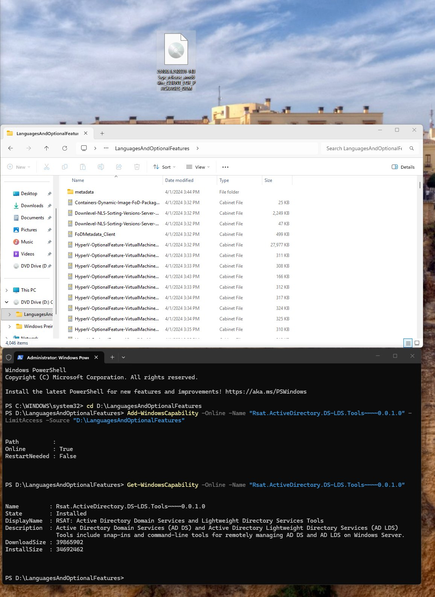

---

## Outcome

`holl.domain` is now a securely-configured, enterprise-style domain with a clean baseline: departmental OUs, role-based share access enforced through AGDLP, scoped helpdesk delegation, and a separated admin account. Just as importantly, it is now **observable** — native Advanced Audit Policy (logons, account/group changes, process creation with command line, Kerberos) and Sysmon are deployed fleet-wide via GPO and confirmed producing events on every machine. Every control was verified end to end (share isolation, delegation scope, audit logging, and Sysmon telemetry), so the domain is ready to feed a SIEM and serve as the foundation for the detection and incident-response work in Part 5.

---

## Next Steps

**Part 5 (planned):** introduce a vulnerable/domain-joined host, forward Security + Sysmon logs to a SIEM (Splunk), and build detections. Deliberate misconfigurations (Kerberoastable SPN account, privilege-creep, etc.) will be planted there as detection targets — *intentionally held back from Part 4 so the secure baseline is established first.*
